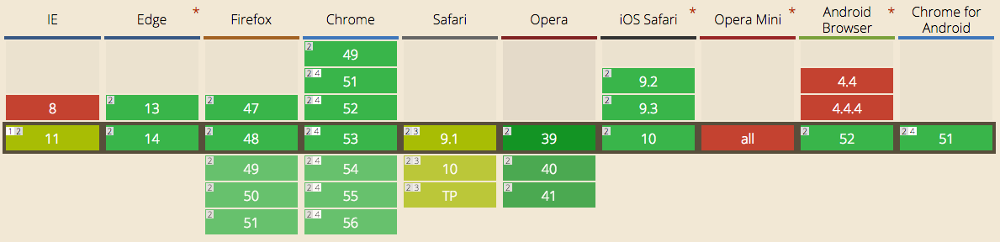
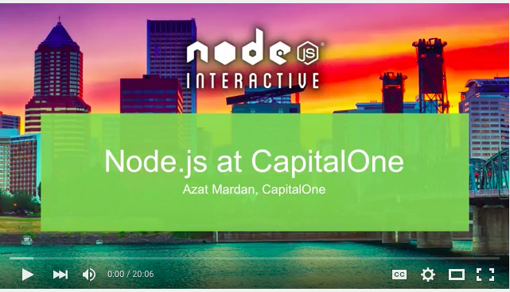

# `h2-node` or Implementing HTTP/2 Server with Node and Express

---

# Slides & Code :page_facing_up: 💻

Everything (PDF, Markdown, Code): <https://github.com/azat-co/h2-node>

---

# Better Apps—Better Life

Big idea: Web, HTTP and JavaScript are everywhere... and Node has some cool core features... What if the world can be a better place if more developers master Node?

---

# About Presenter

---

# Capital One in Top 10 US Banks

---

^Wrote and published 12 books not counting Korean, Chinese, Polish and Russian translations

---

# About Presenter

* Work: Technology Fellow at Capital One (kind of a big deal)
* Experience: FDIC, NIH, DocuSign, HackReactor and Storify
* Books: React Quickly, Practical Node.js, Pro Express.js, Express.js API and 8 others
* Teach: [NodeProgram.com](http://NodeProgram.com)

---

Azat Mardan

Twitter: @azat_co
Email: hi@azat.co
Blog: webapplog.com

---

# HTTP/2

It's here.

---

Really is here

<http://caniuse.com/#feat=http2>

---

# Want to work with Node but your boss won't let you?

Capital One is hiring ~2,000 more software engineers in UK, Canada and US.

<https://jobs.capitalone.com>

We use Node and other cutting-edge open source tech a lot! (React, Kotlin, Clojure, Angular 2, TypeScript, Go, etc.)

---

# Learn More

Node at Capital One by Azat Mardan at Node Interactive 2015

<https://www.youtube.com/watch?v=BJPeLJhv1Ic>

---

# Tip

Email me to be referred for a job at Capital One.

---

# My Contacts

Twitter: @azat_co
Email: hi@azat.co

---

# 30-Second Summary

1. `spdy`
1. Express
1. Server Push

---

# Slides & Code :page_facing_up:

Everything: <https://github.com/azat-co/h2-node>

---

# Want to learn more about Node.js?

Check out [Node.University](http://node.university), [Webapplog.com](http://webapplog.com) and [NodeProgram.com](http://NodeProgram.com) for the best online and in-person education!

---

<http://node.university>

---

# One Last Thing 👉

---

# CodingHorror.com

