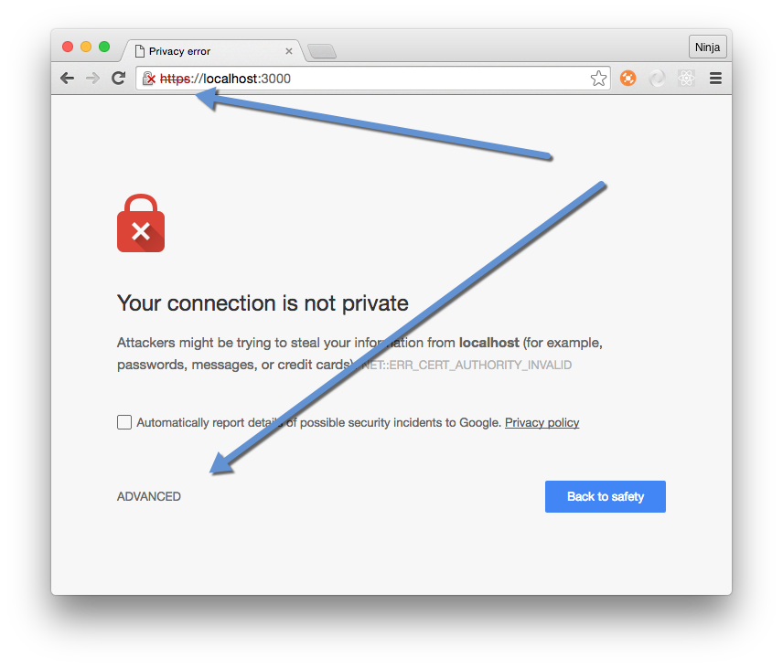
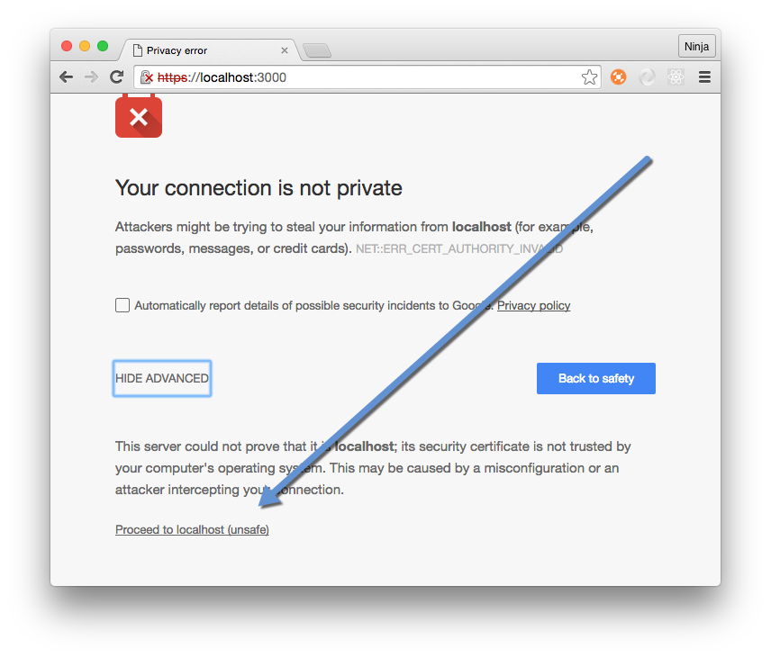
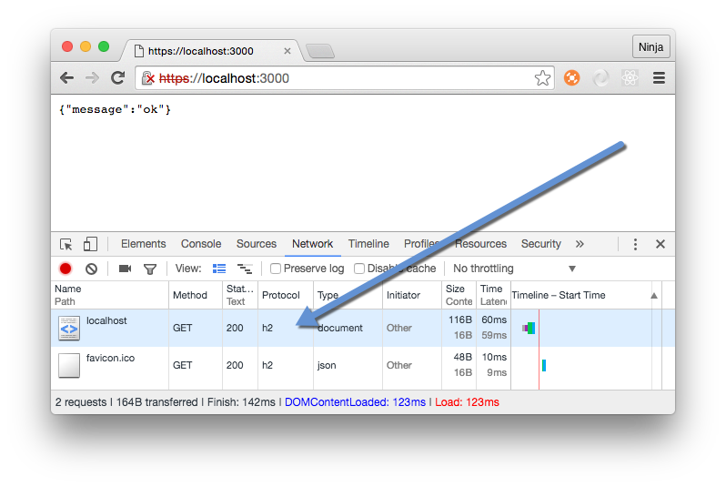
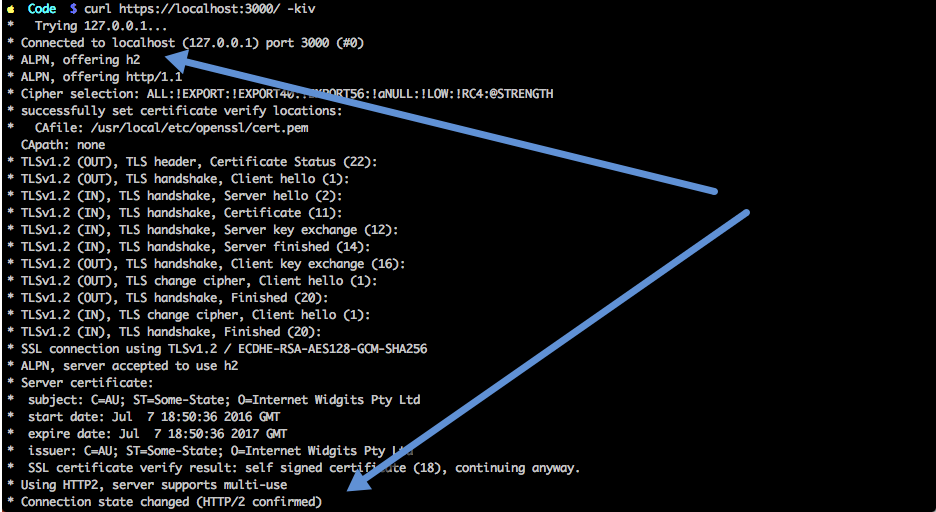

# `h2-node` or Implementing HTTP/2 Server with Node and Express

---


# Slides & Code :page_facing_up: 💻

Everything (PDF, Markdown, Code): <https://github.com/azat-co/h2-node>

---

# Better Apps—Better Life

Big idea: Web, HTTP and JavaScript are everywhere... and Node has some cool core features... What if the world can be a better place if more developers master Node?

---

# About Presenter

---

# Capital One in Top 10 US Banks


---


^Wrote and published 12 books not counting Korean, Chinese, Polish and Russian translations

---

# About Presenter

* Work: Technology Fellow at Capital One (kind of a big deal)
* Experience: FDIC, NIH, DocuSign, HackReactor and Storify
* Books: React Quickly, Practical Node.js, Pro Express.js, Express.js API and 8 others


---

Azat Mardan


* Teach: [NodeProgram.com](http://NodeProgram.com)
* Twitter: @azat_co
* Email: hi@azat.co
* Blog: webapplog.com

---

# HTTP/2

It's here.


---


Really is here


<http://caniuse.com/#feat=http2>


---

# History of H2

Started at SPDY at Google

---

# Benefits of H2

---


# Multiplexing

^Allows browsers to include multiple requests in a single TCP connection which in turn enables browsers to request all the assets in parallel.

---

# Server push

^Servers can push web assets (CSS, JS, images) before a browser knows it needs them which speeds up page load times by reducing number of requests.

---


# Stream priority


^Allows browsers to specify priority of assets. For example, browser can request HTML first to render it before any styles or JavaScript.

---


# Header compression

^All HTTP/1.1 requests have to have headers which are typically duplicate the same info, while H2 forces all HTTP headers to be sent in a compressed format.


---

# Encryption*

* De facto mandatory encryption

^Although the encryption is not required, most major browsers implement H2 only over TLS (HTTPS).

---

# TL;DR

Old methods of HTTP/1 might not work and might even harm!

^Domain sharding, file concatenation, sprites

---

# Let's Get Our Hands Dirty

---

# SSL Key+Cert

```
$ mkdir http2-express
$ cd http2-express
$ openssl genrsa -des3 -passout pass:x -out server.pass.key 2048
...
$ openssl rsa -passin pass:x -in server.pass.key -out server.key
writing RSA key
$ rm server.pass.key
$ openssl req -new -key server.key -out server.csr
...
Country Name (2 letter code) [AU]:US
State or Province Name (full name) [Some-State]:California
...
A challenge password []:
...
$ openssl x509 -req -sha256 -days 365 -in server.csr -signkey server.key -out server.crt
```

---

# H/2 and Node

* `spdy` - like
* `http2` - not like
* core `http2` (based on `nghttp2`) - coming! ([GitHub issue](https://github.com/nodejs/CTC/issues/6))

---

# `spdy`

```
npm init
npm i express spdy -S
```

---

```js
const port = 3000
const spdy = require('spdy')
const express = require('express')
const path = require('path')
const fs = require('fs')

const app = express()
```


---


```js
app.get('*', (req, res) => {
    res
      .status(200)
      .json({message: 'ok'})
})
```

---

```
const options = {
    key: fs.readFileSync(__dirname + '/server.key'),
    cert:  fs.readFileSync(__dirname + '/server.crt')
}
```


---

```js
spdy
  .createServer(options, app)
  .listen(port, (error) => {
    if (error) {
      console.error(error)
      return process.exit(1)
    } else {
      console.log('Listening on port: ' + port + '.')
    }
  })
```

---

# Start

```
node server
```

---



---



---



---

# Using CURL

---


```
curl https://localhost:3000/ -k
```

[Make sure you got the latest version 7.46 with nghttp2)](https://simonecarletti.com/blog/2016/01/http2-curl-macosx/)

---




---

# Want to work with Node but your boss won't let you?

Capital One is hiring ~2,000 more software engineers in UK, Canada and US.

<https://jobs.capitalone.com>

We use Node and other cutting-edge open source tech a lot! (React, Kotlin, Clojure, Angular 2, TypeScript, Go, etc.)


---

# Learn More

Node at Capital One by Azat Mardan at Node Interactive 2015

<https://www.youtube.com/watch?v=BJPeLJhv1Ic>


---

# Tip

Email me to be referred for a job at Capital One.

---

# My Contacts

Twitter: @azat_co
Email: hi@azat.co

---


# 30-Second Summary

1. `spdy`
1. Express
1. Server Push

---


# Slides & Code :page_facing_up:

Everything: <https://github.com/azat-co/h2-node>

---


# Want to learn more about Node.js?

Check out [Node.University](http://node.university), [Webapplog.com](http://webapplog.com) and [NodeProgram.com](http://NodeProgram.com) for the best online and in-person education!


---


<http://node.university>

---

# One Last Thing 👉

---

# CodingHorror.com


