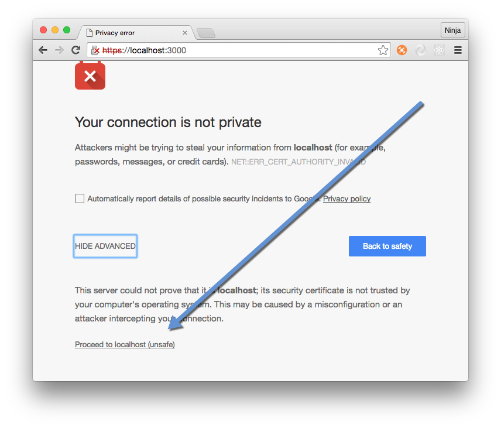
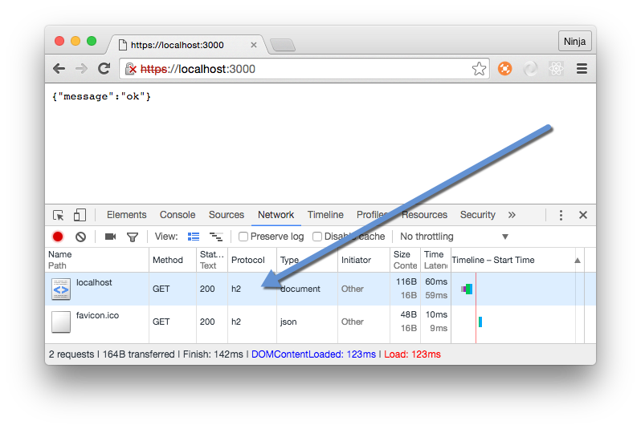
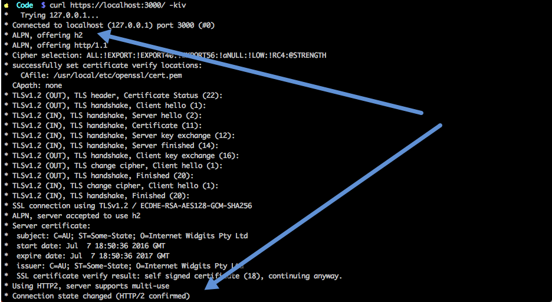

footer: © NodeProgram.com, Node.University and Azat Mardan 2016
slidenumbers: true

# HTTP/2 with Node and Express
## Implementing Future Web


Azat Mardan @azat_co


---


# Slides 👓 :page_facing_up: 💻

PDF+Markdown: <https://github.com/azat-co/h2-node>

---

# HTTP/2

It's here.


---


Really is here


<http://caniuse.com/#feat=http2>


---

# History of H2

Started at SPDY at Google

---

# Benefits of H2

---


# Multiplexing

---

## Multiple requests in a single TCP connection means browsers can request all assets in parallel.

---

# Server push

---

## Servers can push assets, such as CSS, JS, and images, before a browser knows it needs them

---

## Faster load times by utilizing render time and reducing number of requests.

---

# Without Server Push

1. Client requests HTML and server responds
1. Browser renders HTML
1. Browser requests additional assets: images, scripts, CSS
1. Server responds
1. Browser renders page with assets

---

# Server Push Scenario

1. Client requests HTML and server responds
1. Server knows HTML will need certain assets, and pushes assets while browser is busy rendering HTML
1. Browser renders HTML and uses pushed assets instead of requesting them

---

## Browser will only use pushed assets if it needs them.

---


# Stream priority

---

## Stream priority allows browsers to specify priority of assets. For example, browser can request HTML first to render it before any styles or JavaScript.

---


# Header compression

---

## All HTTP/1.1 requests have to have headers which are typically duplicate the same info.

---

## H2 forces all HTTP headers to be sent in a compressed format.


---

# Encryption*

---

## `*` De facto mandatory encryption

---

## Although the encryption is not required, most major browsers implement H2 only over TLS (HTTPS).

---

# TL;DR: Old methods of HTTP/1 might not work and might even harm!

---

## Examples: Domain sharding, file concatenation, sprites

---

# HTTP/2 with Node and Express
## H2 Express Server


Azat Mardan @azat_co


---

# Let's Get Our Hands Dirty

---

# SSL Key+Cert

```
$ mkdir http2-express
$ cd http2-express
$ openssl genrsa -des3 -passout pass:x -out server.pass.key 2048
...
$ openssl rsa -passin pass:x -in server.pass.key -out server.key
writing RSA key
$ rm server.pass.key
$ openssl req -new -key server.key -out server.csr
...
Country Name (2 letter code) [AU]:US
State or Province Name (full name) [Some-State]:California
...
A challenge password []:
...
$ openssl x509 -req -sha256 -days 365 -in server.csr -signkey server.key -out server.crt
```

---

# H/2 and Node

* `spdy` - like
* `http2` - not like
* core `http2` (based on `nghttp2`) - coming! ([GitHub issue](https://github.com/nodejs/CTC/issues/6))

---

# `spdy`

```
npm init
npm i express spdy -S
```

---

```js
const port = 3000
const spdy = require('spdy')
const express = require('express')
const path = require('path')
const fs = require('fs')

const app = express()
```


---


```js
app.get('*', (req, res) => {
    res
      .status(200)
      .json({message: 'ok'})
})
```

---

```
const options = {
    key: fs.readFileSync(__dirname + '/server.key'),
    cert:  fs.readFileSync(__dirname + '/server.crt')
}
```


---

```js
spdy
  .createServer(options, app)
  .listen(port, (error) => {
    if (error) {
      console.error(error)
      return process.exit(1)
    } else {
      console.log('Listening on port: ' + port + '.')
    }
  })
```

---

# Start

```
node server
```

---


---



---



---

# Using CURL

---


```
curl https://localhost:3000/ -k
```

[Make sure you got the latest version 7.46 with nghttp2)](https://simonecarletti.com/blog/2016/01/http2-curl-macosx/)

---




---

# HTTP/2 with Node and Express
## Server Push


Azat Mardan @azat_co


---

# Server Push—Yeah!

^The way server push works is by bundling multiple assets and resources into a single HTTP/2 call. Under the hood, server will issue a PUSH_PROMISE. Clients (browsers included) can use it or not depending on if the main HTML file needs it. If yes, it needs it, then client will match received push promises to make them look like a regular HTTP/2 GET calls. Obviously, if there's a match, then no new calls will be made, but the assets already at the client will be used. Some good articles for more info on server push benefits.

---


```js
const http2 = require('spdy')
const logger = require('morgan')
const express = require('express')
const app = express()
const fs = require('fs')
```

---


```js
app.use(logger('dev'))
```


---


```js
app.get('/', (req, res) => {
  res.send(`hello, http2!
go to /pushy`)
})
```

---

```js
app.get('/pushy', (req, res) => {
  var stream = res.push('/main.js', {
    status: 200, // optional
    method: 'GET', // optional
    request: {
      accept: '*/*'
    },
    response: {
      'content-type': 'application/javascript'
    }
  })
  stream.on('error', () => {
  })
  stream.end('alert("hello from push stream!");')
  res.end('<script src="/main.js"></script>')
})
```

---

```js
var options = {
  key: fs.readFileSync('./server.key'),
  cert: fs.readFileSync('./server.crt')
}

http2
  .createServer(options, app)
  .listen(8080, ()=>{
    console.log(`Server is listening on https://localhost:8080.
You can open the URL in the browser.`)
  }
)
```

---

# Result

```
GET /pushy 200 4.918 ms - -
```

^Single request but we see alert

---


^Demo if you have time

---

# 30-Second Summary

1. `spdy` or http2 core (soon)
1. Express rocks
1. Server Push - yeah!

---


# Code


* <https://github.com/azat-co/http2-express>
* <https://github.com/azat-co/http2-node-server-push>

# Slides 👓 :page_facing_up: 💻

PDF+Markdown: <https://github.com/azat-co/h2-node>

